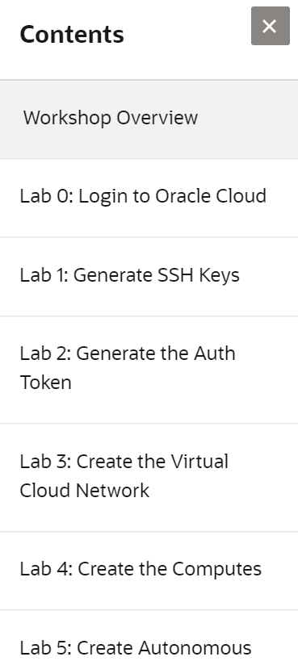

# Move and Improve Applications to OCI and ATP #

## Workshop Overview ##

In this workshop you will move or migrate an existing application and database solution to the Oracle Cloud and Autonomous Database.  You will be using many of the features of the Oracle Cloud including virtual cloud networking, security lists, route rules, gateways, and private subnets.  After migrating the solution, you will enable ATP features like auto scaling to improve the performance of your application.  This workshop covers key practices for moving and improving your own applications to OCI and ATP. The class can be instructor-led or self-paced learning.

## Workshop Requirements

- Account access to Oracle Cloud Infrastructure
- You will need an account that allows you to create a VCN, up to two cores of compute, and up to three cores of Autonomous Database.  If this is an instructor-led workshop an account will be provided to you.
- Knowledge of network concepts
- Knowledge of database concepts

## Agenda

- **Lab 0 :** Log in to the Oracle Cloud

Connect to the Oracle Cloud with your account information.

- **Lab 1** : Generate SSH Keys

Create the SSH public and private keys for secure access to your cloud compute environment.

- **Lab 2** : Generate the Auth Token

Create the Auth Token password to access your cloud object store.  This lab is not required for instructor-led training.

- **Lab 3 :** Create the Virtual Cloud Network

This section describes creating the virtual cloud network or VCN using the quick start wizard.

- **Lab 4 :** Create the Computes

This section describes creating two computes for your lab environment.  One compute will be used as a bastion node.  The second compute will be used as your application server.

- **Lab 5 :** Create Autonomous Database

This section describes creating the Oracle Autonomous Database.  We will provision the Autonomous Transaction Processing or ATP.

- **Lab 6 :** Copy SSH Key and Wallet

This section describes copying the ssh key and wallet for secure access to the private subnet and to ATP.

- **Lab 7 :** Install the Application and Migrate the Database

This section describes installing the Oracle client software and the application to your compute.  You will also migrate the database using Data Pump.

- **Lab 8 :** Run the Application Workload

This section describes running the application workload and scaling the ATP for higher performance using manual scaling and then auto scaling.

- **Lab 9:** Manage Storage Volumes and Images

This section shows you how to manage storage volumes and images that make it easy to move or "lift" your applications to the Oracle Cloud.

## Access the labs ##

- Use **Lab Contents** menu on your right to access the labs.
    - If the menu is not displayed, click the menu button  on the top right  make it visible.

- From the menu, click on the lab that you like to proceed with. For example, if you like to proceed to **Lab 0**, click **Lab 0: Login to the Oracle Cloud**.

- You may close the menu by clicking 

