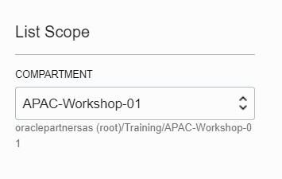

# **Lab Accounts** and Artifacts

To log in to the Oracle Cloud, you will need the following.

Oracle Cloud URL:  

Cloud Tenant:  

User Name:  

Password:  

## Region

You will be doing all your labs in one of the Oracle Cloud regions below.  You will be choosing the region closest to you.

Australia Southeast (Melbourne)

South Korea (Chuncheon)

India South (Hyderabad)

## Compartment

All your lab work will be done in a compartment.  A compartment is a workspace which holds all your cloud resources.   For this lab everyone will be using the same compartment.  

Compartment:  APAC-Workshop-1

## SSH Keys

For an instructor-led workshop, you can use the SSH keys provided below.   Alternatively you can create your own keys with a tool like puTTYgen (Windows) or ssh-keygen (Linux or Mac).  The keys will be used to securely connect to your compute instance on the Oracle Cloud.   

Download and unzip your keys:  

You will provision your compute instance with the public key, **labkey.pub**.  

From a Windows client, you will use **labkey.ppk** with PuTTY to connect to your instance.  For Mac clients, you will use the **labkey** file with no extension to connect to your instance. 

Public key:  labkey.pub

Private key: labkey.ppk (Windows) or labkey (Mac)

Note: SSH keys are required to access Oracle Cloud compute instances.  

## SQL Developer

Oracle SQL Developer is a free integrated development environment for your database.  Download SQL Developer.  Select the version for your OS.  [https://www.oracle.com/tools/downloads/sqldev-v192-downloads.html](https://www.oracle.com/tools/downloads/sqldev-v192-downloads.html)

## Object Store Password

This password will be used by the database to access the Oracle Object Store in one of the labs.  Note it for now.

Auth Token Password:  

## Database Dump File

This dump file is an export of an on-premise Oracle database.  You will use it in one of the labs to import "move" it to the cloud database.  Do not download the dump file to your laptop.  We will import it directly from the Object Store later.

Melbourne, Australia: 

Chuncheon, S Korea: 

Hyderabad, India: 

