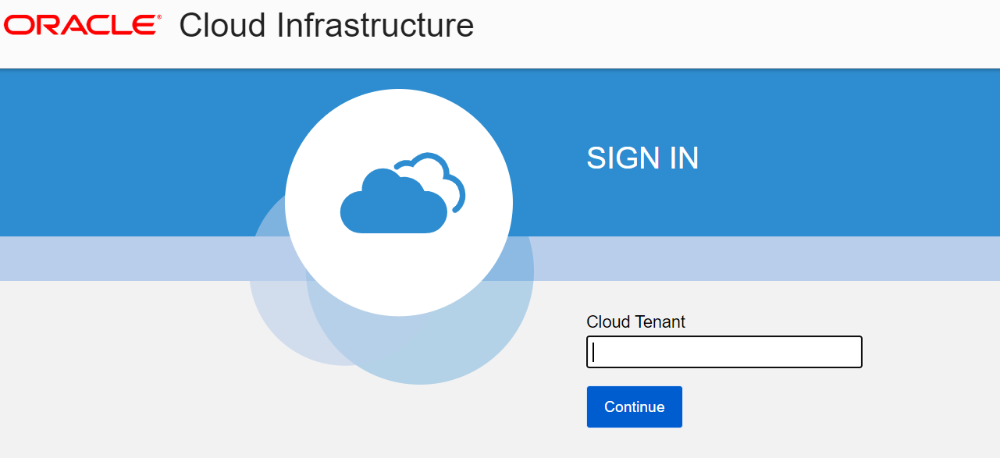
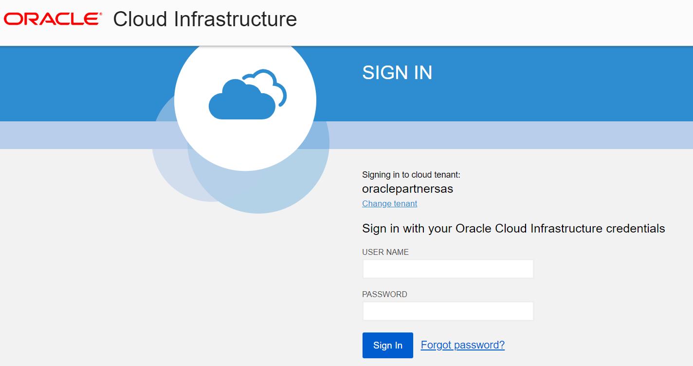
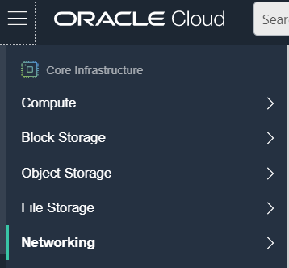
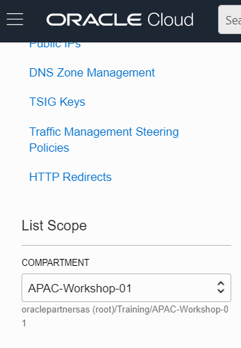
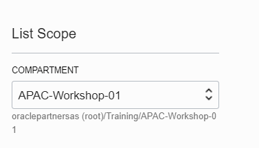

# Login to Oracle Cloud #

In this lab you will connect to the Oracle Cloud and select your region to work in.

## Disclaimer ##
The following is intended to outline our general product direction. It is intended for information purposes only, and may not be incorporated into any contract. It is not a commitment to deliver any material, code, or functionality, and should not be relied upon in making purchasing decisions. The development, release, and timing of any features or functionality described for Oracle’s products remains at the sole discretion of Oracle.

## Requirements ##

- Laptop or desktop computer
- Web browser
- Account access to Oracle Cloud Infrastructure
  - The account is provided to you if it is instructor-led training, otherwise use your account 

## Step 1 - Log in to Oracle Cloud ##

1. From your browser go to Oracle Cloud. The URL is [https://console.ap-seoul-1.oraclecloud.com](https://console.ap-seoul-1.oraclecloud.com)
2. Enter your Cloud Tenant or account name:  **oraclepartnersas**

​	3. Enter your User Name:  

​	4. Enter your Password:  

You should see the Quick Actions dashboard.

Note the region selection and the menu of cloud services on the upper left corner.

​	5. Select the region you would like to work in.  Your choices are South Korea (Chuncheon), India South (Hyderabad),  Australia Southeast (Melbourne).  Select the one closest to you.

 6. Click on the Cloud Service hamburger menu on the upper left hand corner

 7. Select Networking/Virtual Cloud Networks

    

    

	

    8. Select your compartment: APAC-Workshop-1

       
   
       
   
       You may need to expand the selection to see your compartment under Training.
       
       ​									 
    
     
    
    **Important**: Select your correct **region** and **compartment** when doing all your lab work.
    
     

## Acknowledgements ##

- **Author** - Milton Wan, Database Product Management, April 2020

